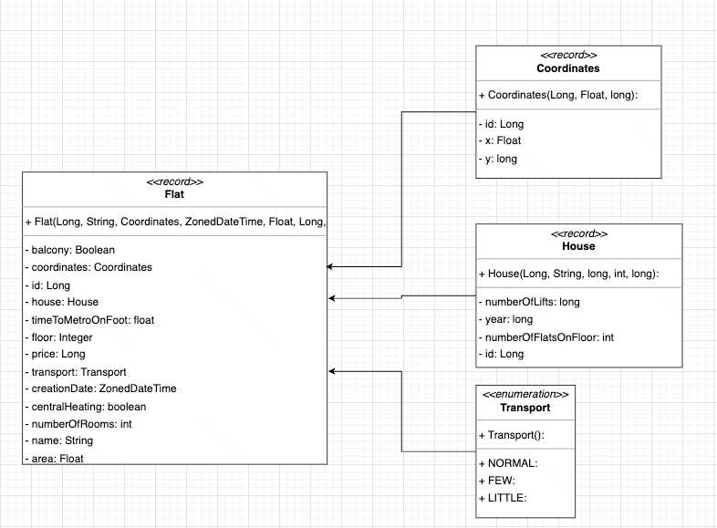
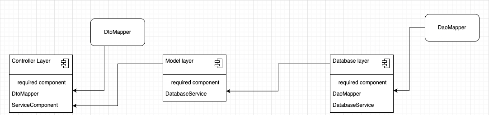

# Лабораторная работа №1

## Текст задания
```java
public class Flat {
    private Long id; //Поле не может быть null, Значение поля должно быть больше 0, Значение этого поля должно быть уникальным, Значение этого поля должно генерироваться автоматически
    private String name; //Поле не может быть null, Строка не может быть пустой
    private Coordinates coordinates; //Поле не может быть null
    private java.time.ZonedDateTime creationDate; //Поле не может быть null, Значение этого поля должно генерироваться автоматически
    private Float area; //Значение поля должно быть больше 0
    private Long price; //Значение поля должно быть больше 0
    private Boolean balcony; //Поле может быть null
    private float timeToMetroOnFoot; //Значение поля должно быть больше 0
    private int numberOfRooms; //Максимальное значение поля: 20, Значение поля должно быть больше 0
    private Integer floor; //Значение поля должно быть больше 0
    private boolean centralHeating;
    private Transport transport; //Поле не может быть null
    private House house; //Поле не может быть null
}
public class Coordinates {
    private Float x; //Поле не может быть null
    private long y; //Значение поля должно быть больше -166
}
public class House {
    private String name; //Поле может быть null
    private long year; //Значение поля должно быть больше 0
    private int numberOfFlatsOnFloor; //Значение поля должно быть больше 0
    private long numberOfLifts; //Значение поля должно быть больше 0
}
public enum Transport {
    FEW,
    LITTLE,
    NORMAL;
}
```

## UML диаграммы
### Диаграмма классов модели
> Найти можно по ссылке [тут](https://app.diagrams.net/?&highlight=0000ff&edit=_blank&layers=1&nav=1&title=exported_from_idea.drawio#G1_X1spDJs_FDu8R6O2rMoSLBPGGOyeg6H%23%7B%22pageId%22%3A%22Jv4MZq8C3dXZkXbW1Nuf%22%7D)



### Архитектурная диаграмма
> Найти можно по ссылке [тут](https://drive.google.com/file/d/13DYkekXSOlTB1UEZRJD2YAbqLAv7MWSZ/view?usp=sharing)




